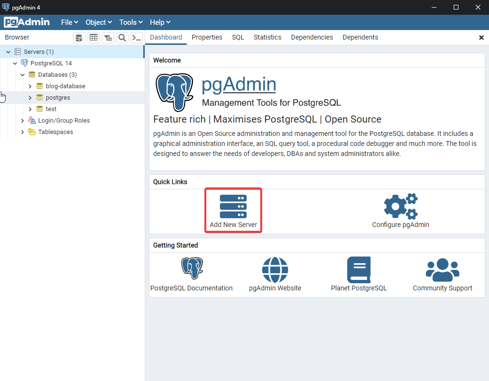
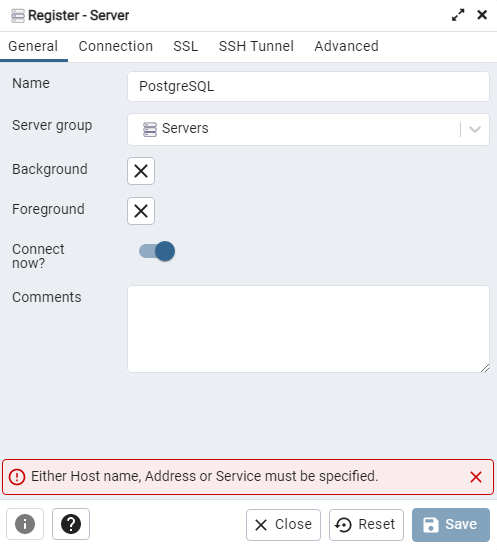
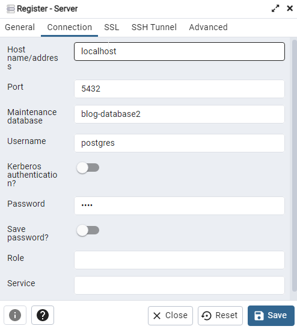
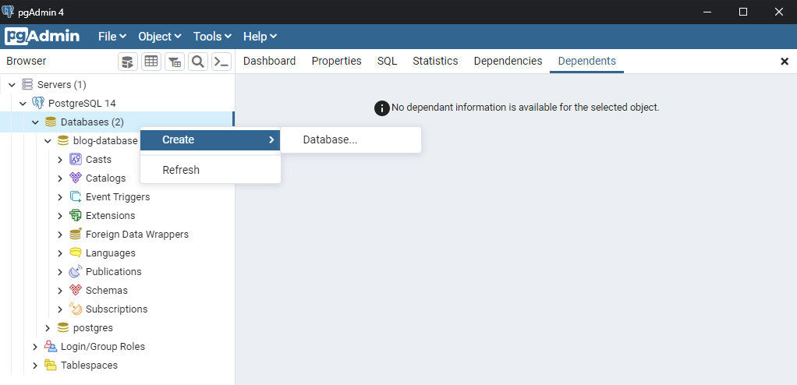
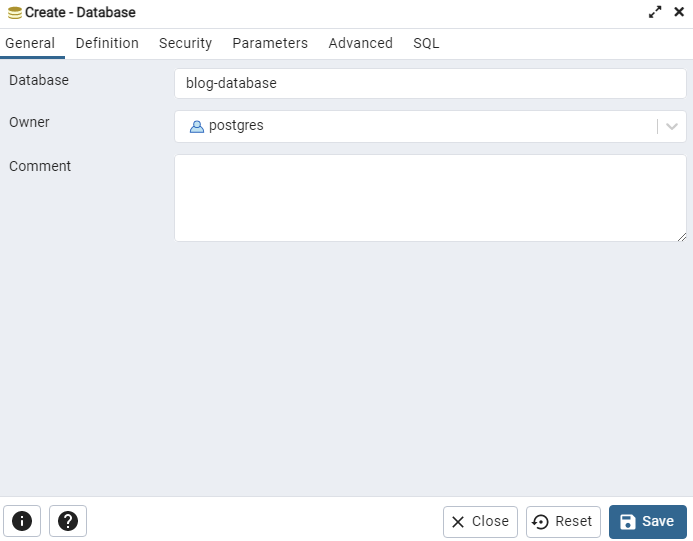
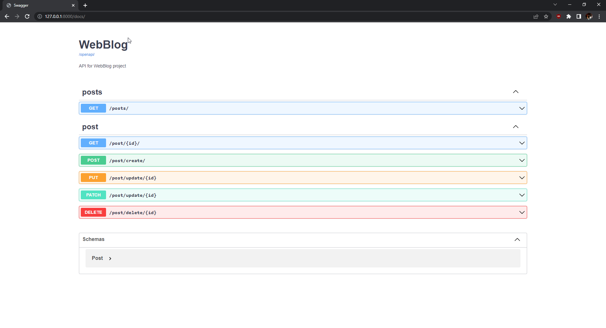
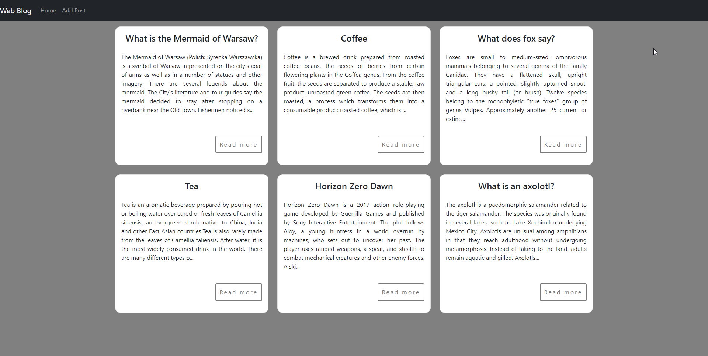

# WebBlog

The purpose of this task is to create an E2E experience of a Blog application.

## Technologies
Here is a list of technologies which should be used for this project:
* Backend:
  * Python (Django + DRF)
* Frontend:
  * Typescrip (React, minimal CSS - MUI5)
* Database:
  * PSQL

Nice to have:
* Firebase

## ToDo 

List of tasks which should be done for this project.

### Backend
- [X] Create a REST API that will allow to:
  - [X] Create a post
  - [X] Edit a post
  - [X] Delete a post
  - [X] List all posts
  - [X] Get single post
- [ ] Add test coverage
- [ ] Prepare README:
  - [ ] Prepare README
  - [ ] Explain deployment steps

Nice to do:
- [ ] Count post views, save it in the database and return in endpoint responses
- [ ] Authorization
- [X] Swagger
- [ ] Permissions:
  - [ ] Admin user should be able to create, edit and delete posts
  - [ ] Standard user should be able to view and list posts

### Frontend
- [X] Blog should contain a list of:
  - [X] All posts 
  - [X] A single post view.
- [X] Fetch data from the API
- [X] Send data to the API
- [ ] Prepare README
  - [ ] Explain local usage
  - [ ] Explain deployment steps

Nice to do:
- [ ] Count post views and display in the post view
- [ ] Responsive design (mobile and tablet friendly) - can use MUI5
- [ ] Authorization
- [X] Axios (HTTP requests)
- [ ] Permissions:
  - [ ] Admin user should be able to create, edit and delete posts
  - [ ] Standard user should be able to view and list posts
  

## Running project locally

In this section, you will find all the steps for preparing an environment to run the WebBlog project locally on your computer.
Please remember that you should run frontend and backend server at the same time to be able to see a fully functioning application. 

### Operating system

Program was created on Windows 10 Home.

### Environment

The whole environment was set up with [conda](https://docs.conda.io/en/latest/) which can be downloaded and installed from [this link](https://docs.conda.io/en/latest/miniconda.html).

### Backend

#### PostgresSQL

Install PostgresSQL from the official PostgreSQL [download section](https://www.postgresql.org/download/).
You can follow [this instruction](https://www.enterprisedb.com/docs/supported-open-source/postgresql/installer/02_installing_postgresql_with_the_graphical_installation_wizard/01_invoking_the_graphical_installer/).

:exclamation: If you will change any of the below names, the application will not work. You will have to change `DATABASES` properties in `backend/mainapp/mainapp/settings.py` file. :exclamation:

After installation, open `pgAdmin` you have to add a new server and create a new empty database:

1. Log in to the PostgreSQL database server using pgAdmin.
2. Go to the `Dashboard` tab. In the `Quick Link` section, click `Add New Server` to add a new connection.

3. In `General` tab, enter the name of server: PostgreSQL.

4. Select the `Connection` tab in the `Create-Server` window. Then, configure the connection as follows:
   1. Host name/addres: localhost
   2. Port: 5432
   3. Maintenance database: `postgres`
   4. Username: postgres
   5. Password: test     
   
5. Click on `Save` button.
6. In your `PostgreSQL` server, right-click the Databases node and select Create > Database… menu item.

7. Enter the name of the database (`blog-database`) and select an owner (`postgres`) in the general tab.

8. Click on `Save` button.

#### Python and Django

To run this project, you have to install python and other necessary tools / libraries like: Django, djangorestframework, etc. 

You can do it by following these steps:

1. Clone this repo and go to the main folder (`WebBlog`) in your terminal.
2. Run below command: it will create a conda environment with all dependencies. :warning: Installation can take a few minutes.
  ```commandline
  conda env create -f environment.yaml
  ```
3. Change conda environment with below command:
    ```commandline
    test-env
    ```

#### Run backend server

To run backend server, you have to:
1. Go to `backend/mainapp` in your terminal.
2. Run this command:
    ```commandline
    python manage.py runserver
    ```
3. Go to http://127.0.0.1:8000/docs/ page. You should see Swagger documentation.



### Frontend

To run an application you have to install `nodejs` package. If the above steps for the backend have been performed, `nodejs` has been installed while creating a conda environment.

#### Run frontend server

To run frontend server, you have to:
1. Go to `react_app` in your terminal.
2. Run this command:
    ```commandline
    npm start
    ```
3. Go to http://localhost:3000/ page. Here is an example view (depends on the contents in the database).



## Deployment steps

### Backend

1. As a first step, I prepared an environment. The whole environment was set up with [conda](https://docs.conda.io/en/latest/).
2. Create Django project with `django-admin startproject mainapp` command.
3. Create a new Django `webblog` app and add it in project settings (i.e. `mainapp/settings.py` file).
4. Install PostgresSQL and create new database by pgAdmin.
5. Connect PostgresSQL database with app by changing `DATABASES` in `mainapp/settings.py`.
6. Migrate schema to a database by `python manage.py migrate` command.
7. Create admin by `python manage.py createsuperuser` command.
8. Create a Post model which will store posts from blog. This model was also added to `webblog/adming.py` so admin can create post from the administration site.
9. Create first REST API: getting list of all posts.
10. Create all API methods: create, edit, delete, list all, get single. I decided to have separate API for each request instead of using `RetrieveUpdateDestroyAPIView`. In my opinion, it is more clear that way.

### Frontend

TBA